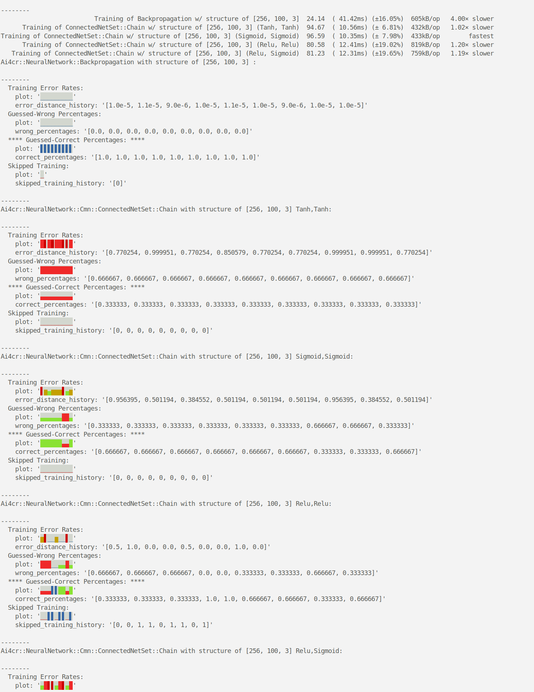

# ai4cr

CircleCI status: [](https://circleci.com/gh/drhuffman12/ai4cr)

[](https://GitHub.com/drhuffman12/ai4cr/releases/)

Artificial Intelligence for Crystal (based on https://github.com/SergioFierens/ai4r)

## Installation

Add this to your application's `shard.yml`:

```yaml
dependencies:
  ai4cr:
    github: drhuffman12/ai4cr
    branch: master
```

## Usage

```crystal
require "ai4cr"
```

So far, only Ai4cr::NeuralNetwork::Backpropagation and related tests have been ported.

NOTE: `marshal_dump` and `marshal_load` from ai4r have been replaced by `to_json` and `from_json` instead, e.g.:

```
# Create and save a net
net = Ai4cr::NeuralNetwork::Backpropagation.new(...)
File.write("../ai4cr_ui/db/seeds/BackpropagationNet.new.json",net.to_json)

# Train and save a net
net.train(some_input, expected_output)
File.write("../ai4cr_ui/db/seeds/BackpropagationNet.trained.json",net.to_json)

# Verify serialization in a spec
json = net.to_json
net2 = Ai4cr::NeuralNetwork::Backpropagation.from_json(json)
assert_approximate_equality_of_nested_list net.weights, net2.weights, 0.000000001
```

## Comparison benchmarks

REMINDER: Running Crystal in a Docker container (at least used to) runs slower than running Crystal on bare-metal.
So, for more performance, run it outside of a Docker container.

To build and run them:

```
crystal build --release  src/bench/mini_nets_vs_backprop.cr
./mini_nets_vs_backprop
```

Example output:



To dig deeper into performance refinement:

```
crystal build --release src/mini_nets_vs_backprop
mkdir -p tmp/
valgrind --tool=callgrind --cache-sim=yes --branch-sim=yes --callgrind-out-file=tmp/mini_nets_vs_backprop.out ./mini_nets_vs_backprop
```

## Importing and Exporting as JSON data

NOTE: Parsing to/from JSON can cause slight discrepancies in the float values. This difference shouldn't matter much, but in case you're interested:

  Parsing Float64 values to/from JSON is sometimes slightly off, but only by about 0.0000000000000001%. This seems more likely when scientific notation gets involved, which could happen during the first training session, but becomes more likely the more times the net is trained.

For example, see below example code and note discrepancies after the "033410668390063" parts:

```
require "json"

# a = 6.033410668390063e-5
# a = 6.0334106683900631e-5
# a = 0.60334106683900634
a = 0.60334106683900631
      
b = a.to_json
c = JSON.parse(b)
puts "a,b,c == #{[a, b, c]}"
      
# GIVEN "a = 6.033410668390063e-5", puts => a == 6.033410668390063e-5; b == "6.033410668390063e-5"; c == 6.0334106683900634e-5 (off)
# GIVEN "a = 6.0334106683900631e-5", puts => a == 6.033410668390063e-5 (off); b == "6.033410668390063e-5" (off); c == 6.0334106683900634e-5 (off)
# GIVEN "a = 0.60334106683900634", puts => a == 0.6033410668390063 (off); b == "0.6033410668390063" (off); c == 0.6033410668390063 (off)
# GIVEN "a = 0.60334106683900631", puts => a == 0.6033410668390063 (off); b == "0.6033410668390063" (off); c == 0.6033410668390063 (off)
```

## Roadmap

- [x] Generate an error history plot using `AsciiBarCharter` and `error_distance_history` , e.g.:
```
plot: '▇▊▂_▅▅▅_▅_▅▅▅▅_▅▅__▅_▅____▅___'
```
(Run `crystal spec spec_examples` to see more error history plot examples. NOTE: These run short training sessions, so some tests are likely to fail some of the time.)

- [ ] Add Cmn ("Connectable Mini Networks") (WIP)
  - [x] simple benchmark comparisons
  - [x] Learning Styles
    - [x] Pelu
    - [x] Relu
    - [x] Sigmoid
    - [x] Tanh
  - [x] MiniNet
    - [x] MiniNetConcerns modules
    - [x] JSON importable/exportable
    - [x] can use various 'Learning Styles'
    - [ ] (?) move 'Learning Styles'-specific methods from MiniNet into Enum
  - [ ] misc Connected Net Sets (WIP)
    - [x] Chain
    - [ ] RNN
    - [ ] (TBD)
    - [ ] ...
  - [ ] (TBD)
  - [ ] ...

- [ ] Add RNN

- [ ] Port from `ai4r`:
  - [ ] classifiers
    - [ ] classifier.rb
    - [ ] hyperpipes.rb
    - [ ] ib1.rb
    - [ ] id3.rb
    - [ ] multilayer_perceptron.rb
    - [ ] naive_bayes.rb
    - [ ] one_r.rb
    - [ ] prism.rb
    - [ ] simple_linear_regression.rb
    - [ ] votes.rb
      - [ ] zero_r.rb
  - [ ] clusterers
    - [ ] average_linkage.rb
    - [ ] bisecting_k_means.rb
    - [ ] centroid_linkage.rb
    - [ ] clusterer.rb
    - [ ] complete_linkage.rb
    - [ ] diana.rb
    - [ ] k_means.rb
    - [ ] median_linkage.rb
    - [ ] single_linkage.rb
    - [ ] ward_linkage_hierarchical.rb
    - [ ] ward_linkage.rb
      - [ ] weighted_average_linkage.rb
  - [ ] data
    - [ ] data_set.rb
    - [ ] parameterizable.rb
    - [ ] proximity.rb
      - [ ] statistics.rb
  - [ ] experiment
      - [ ] classifier_evaluator.rb
  - [ ] genetic_algorithm
      - [ ] genetic_algorithm.rb
  - [ ] neural_network
    - [x] backpropagation.rb
    - [ ] hopfield.rb
  - [ ] som
    - [ ] layer.rb
    - [ ] node.rb
    - [ ] som.rb
    - [ ] two_phase_layer.rb

If you'd like another class of Ai4r ported, feel free to submit a [new issue](https://github.com/drhuffman12/ai4cr/issues/new).

## Contributing

1. Fork it ( https://github.com/drhuffman12/ai4cr/fork )
2. Create your feature branch (git checkout -b my-new-feature)
3. Commit your changes (git commit -am 'Add some feature')
4. Push to the branch (git push origin my-new-feature)
5. Create a new Pull Request

### (Re-)Format

```sh
docker-compose run app scripts/reformat
```

### Build

```sh
# for a cleaner build:
docker-compose build --force-rm --no-cache --pull

# normally:
docker-compose build
```

### Show version

```sh
docker-compose run app scripts/version_info
```

### Add Ameba bin file

TODO: Find out why `bin/ameba` runs fine in CI but not locally.
```sh
docker-compose run app shards update
```

### Test

```sh
docker-compose run app crystal spec
```

### Docker console

```sh
docker-compose run app sh
```

### ICR console

NOTE: This isn't yet Crystal 1.0 compatible!
```sh
icr -r ./src/ai4cr
```

### See also

* The docs at: https://drhuffman12.github.io/ai4cr/

* The specs and https://github.com/SergioFierens/ai4r for more info.

## Contributors

- [drhuffman12](https://github.com/drhuffman12) Daniel Huffman - creator, maintainer

## Example Spec Results (running on a Lenovo Ideapad y700 w/ i7-6700HQ)

I included the triangle-square-cross training example as test cases.

As expected, the net sometimes correctly guesses all of the examples, more or less, depending on how many times it is trained and various other (random) factors.

Below is an example of the net successfully recognizing all nine test cases.

### Setup

```sh
$ cd $MY_DEV_FOLDER

$ git clone https://github.com/drhuffman12/ai4cr.git

$ cd ai4cr

$ docker-compose build
```

### These should NEVER fail!

For any tests that should NEVER fail (e.g.: in spite of sufficient training), put them into `spec`, and run them via:

```sh
$ docker-compose run app scripts/test_always
..............................

Finished in 4.01 milliseconds
30 examples, 0 failures, 0 errors, 0 pending
Execute: 00:00:00.010855717
```

### These will probably SOMETIMES fail!

For any tests that could fails sometimes (e.g.: if not trained enough), put them into `spec_examples`, and run them via:

```sh
$ docker-compose run app scripts/test_sometimes
.............

Finished in 6.76 seconds
16 examples, 0 failures, 0 errors, 0 pending
Execute: 00:00:06.769663359
```

NOTE: That time, it took less than a second to build. I did notice that it took about 10 seconds to build the first run and only less than a second each successive run.
